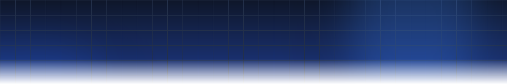

<div align="center">

  <!-- Hero Banner -->
  

  <br><br>

  <!-- Name & Professional Title -->
  <h1>Hi, I'm <span style="color: #38BDF8;">Ankit Raj</span> 👋</h1>
  <h3>AI/ML & Full-Stack Systems Engineer</h3>

  <!-- Typing SVG Banner -->
  <a href="https://ankitraj027portfolio.vercel.app" target="_blank">
    
  </a>

  <br>

  <!-- High-Signal Status Badges -->
  <p align="center">
    
    
    
  </p>

  <!-- Connect Dock Buttons -->
  <p align="center">
    <a href="https://ankitraj027portfolio.vercel.app" target="_blank">
      
    </a>
    <a href="https://www.linkedin.com/in/ankitraj027/" target="_blank">
      
    </a>
    <a href="https://github.com/AnkitRaj027" target="_blank">
      
    </a>
    <a href="mailto:ankitraj.main@gmail.com" target="_blank">
      
    </a>
  </p>

  <p align="center">
    <i>"Bridging foundational AI models with scalable full-stack engineering to build software that solves real problems."</i>
  </p>

</div>

<br>

---

### 👨‍💻 System Architecture & Persona

```python
class SystemsEngineer:
    def __init__(self):
        self.name = "Ankit Raj"
        self.role = "AI/ML & Full-Stack Engineer"
        self.location = "India 🇮🇳"
        self.passions = [
            "Retrieval-Augmented Generation (RAG)",
            "Autonomous Agents & Tool-Calling Workflows",
            "Developer Tools & Code Intelligence",
            "End-to-End High-Performance Web Apps"
        ]
        self.current_obsession = "CodeLens — Deep AST & Semantic Code Comprehension"

    def philosophy(self) -> dict:
        return {
            "principles": [
                "Production over Prototypes",
                "Measure latency, tokens, and retrieval accuracy",
                "Clean APIs & intuitive user experiences"
            ],
            "workflow": "Build → Evaluate → Refine → Ship 🚀"
        }

    def collaborate(self) -> str:
        return "Always eager to partner on innovative AI systems & engineering roles."
```

<br>

---

### 🎯 Engineering Pillars

<table>
  <tr>
    <td width="33%" valign="top">
      <h4>⚡ Production RAG & Search</h4>
      <p>Architecting robust retrieval pipelines using dense embeddings, BM25 keyword matching, cross-encoder reranking, and chunking strategies grounded in domain data.</p>
    </td>
    <td width="33%" valign="top">
      <h4>🤖 Agentic Workflows</h4>
      <p>Building deterministic multi-step agents with tool-calling capabilities, function execution, context management, and guardrails for real-world reliability.</p>
    </td>
    <td width="33%" valign="top">
      <h4>🌐 End-to-End Systems</h4>
      <p>Connecting high-throughput asynchronous backends (FastAPI / Node.js) with fluid, reactive web interfaces (React / Next.js) and scalable database layers.</p>
    </td>
  </tr>
</table>

<br>

---

### 🛠️ Core Technology Stack

<div align="center">

  <!-- Quick Visual Icons Grid -->
  <a href="https://skillicons.dev">
    
  </a>

  <br><br>

  <!-- Detailed Classified Badges -->
  <table>
    <tr>
      <td align="right"><b>AI / GenAI & ML</b></td>
      <td>
        
        
        
        
        
        
        
      </td>
    </tr>
    <tr>
      <td align="right"><b>Languages</b></td>
      <td>
        
        
        
        
        
      </td>
    </tr>
    <tr>
      <td align="right"><b>Backend & Cloud</b></td>
      <td>
        
        
        
        
        
        
      </td>
    </tr>
    <tr>
      <td align="right"><b>Frontend & UI</b></td>
      <td>
        
        
        
        
        
      </td>
    </tr>
    <tr>
      <td align="right"><b>Databases & Tools</b></td>
      <td>
        
        
        
        
        
      </td>
    </tr>
  </table>

</div>

<br>

---

### 🚀 Featured Engineering Projects

<table>
  <thead>
    <tr>
      <th width="28%">Project</th>
      <th width="42%">Architecture & Highlights</th>
      <th width="30%">Stack & Links</th>
    </tr>
  </thead>
  <tbody>
    <tr>
      <td>
        <b>🔍 CodeLens</b>
        <br>
        <sub>AI-Powered Code Analysis & Intelligence Platform</sub>
      </td>
      <td>
        • Deep AST and semantic code evaluation for complex repositories.<br>
        • Instant security flaw detection, dependency mapping, and code optimization suggestions.<br>
        • Interactive visualizer delivering contextual insights directly to developers.
      </td>
      <td>
        <code>FastAPI</code> <code>React</code> <code>LLMs</code> <code>AST</code>
        <br><br>
        <a href="https://github.com/AnkitRaj027/CodeLens" target="_blank">
          
        </a>
        <a href="https://ankitraj027portfolio.vercel.app" target="_blank">
          
        </a>
      </td>
    </tr>
    <tr>
      <td>
        <b>📄 Pocket AI</b>
        <br>
        <sub>Document-Based RAG Knowledge Engine</sub>
      </td>
      <td>
        • Multi-document contextual question answering with strict ground truth citations.<br>
        • Hybrid retrieval (vector embeddings + keyword filtering) to minimize hallucination.<br>
        • Seamless ingestion pipeline for PDFs, TXT, and Markdown files.
      </td>
      <td>
        <code>Python</code> <code>LangChain</code> <code>ChromaDB</code> <code>RAG</code>
        <br><br>
        <a href="https://github.com/AnkitRaj027/Pocket-AI" target="_blank">
          
        </a>
      </td>
    </tr>
    <tr>
      <td>
        <b>💰 PocketCA</b>
        <br>
        <sub>AI-Powered Indian Tax & Advisory Assistant</sub>
      </td>
      <td>
        • Domain-tailored LLM assistant decoding Indian tax regimes and exemptions.<br>
        • Intelligent deduction planning and slab optimization calculators.<br>
        • Contextual guidance designed for quick taxpayer decision-making.
      </td>
      <td>
        <code>Python</code> <code>FastAPI</code> <code>GenAI</code> <code>Financial NLP</code>
        <br><br>
        <a href="https://github.com/AnkitRaj027/PocketCA" target="_blank">
          
        </a>
      </td>
    </tr>
  </tbody>
</table>

<br>

---

### 📊 GitHub Velocity & Analytics

<div align="center">

  <table border="0">
    <tr>
      <td align="center" width="50%">
        
      </td>
      <td align="center" width="50%">
        
      </td>
    </tr>
    <tr>
      <td colspan="2" align="center">
        
      </td>
    </tr>
  </table>

  <br>

  <!-- Snake Contribution Animation -->
  <h4>🐍 Dynamic Contribution Graph</h4>
  

</div>

<br>

---

### 🤝 Let's Connect & Collaborate

<div align="center">

  <p>
    Whether you want to discuss <b>LLM architecture, RAG systems, AI developer tooling</b>, or potential software engineering roles — my inbox is always open.
  </p>

  <a href="https://ankitraj027portfolio.vercel.app" target="_blank">
    
  </a>
  &nbsp;
  <a href="https://www.linkedin.com/in/ankitraj027/" target="_blank">
    
  </a>
  &nbsp;
  <a href="mailto:ankitraj.main@gmail.com" target="_blank">
    
  </a>

  <br><br>

  

  <br>
  <sub>Designed with precision & engineered for performance · © <b>Ankit Raj</b></sub>

</div>
